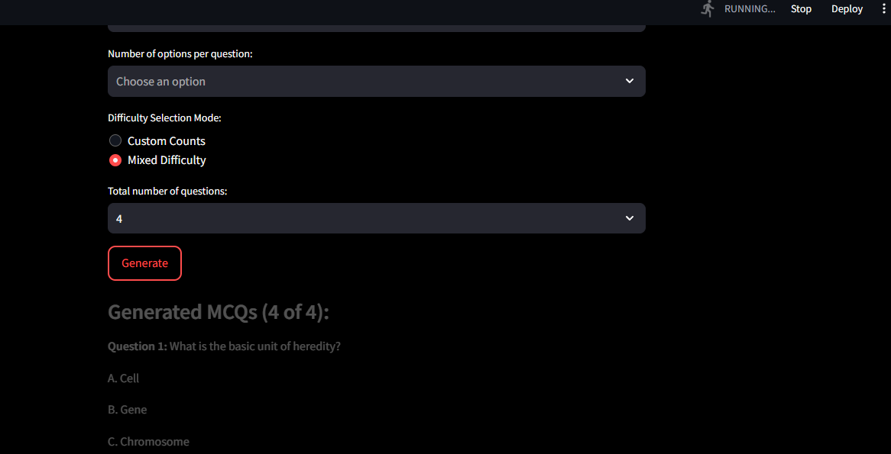
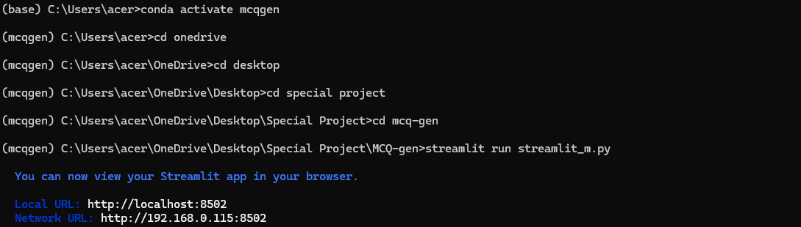

# 🧠 Automated MCQ Generator – Streamlit App using Mistral AI & LangChain

This is an AI-powered Multiple Choice Question (MCQ) generator that creates questions based on either a **topic name** or a **custom block of text**. It uses **Mistral AI's Mixtral-8x7B-Instruct** model for question generation, managed through **LangChain**, and provides an easy-to-use web interface built with **Streamlit**.

---

## Demo

### Streamlit app UI


###  Terminal Startup



---

## 🎯 Features

- Generate MCQs from either a topic or a given text
- Select the number of questions and number of options
- Choose difficulty level: Easy, Medium, or Hard
- Get answers clearly marked along with each question
- Clean Streamlit UI for instant quiz generation
- Logs and validates user input and model responses

---

## 📁 Project Structure

mcq-gen/
├── .env                                                     # Stores Mistral API Key
├── requirements.txt                                         # Python dependencies
├── streamlit_m.py                                           # Main Streamlit app
├── style.css                                                # Optional CSS styling for Streamlit
└── srcm/
    ├── init.py
    ├── mcq_m.py                                             # Core logic to interact with Mistral API
    ├── prompt.py                                            # Prompt template used to generate MCQs
    └── utils.py                                             # Validation and text cleanup functions
└── .gitignore
└── README.md

---

## ⚙️ Setup Instructions

### 1. Clone the Repository

```bash
git clone https://github.com/yourusername/mcq-gen.git
cd mcq-gen
```

### 2. Create a Virtual Environment
```bash
# On Windows:
python -m venv venv
venv\Scripts\activate

# On macOS/Linux
python3 -m venv venv
source venv/bin/activate
```

### 3. Install Dependencies
```bash
pip install -r requirements.txt
```
---

### 4. Add Your API Key
Create a `.env` file in the root directory and add the mistral api key:
```env
MISTRAL_API_KEY=your-mistral-api-key-here
```
---

### 5. Run the App
```bash
streamlit run streamlit_m.py
```
Then open: [http://localhost:8501]( http://localhost:8501)

---

## Technologies Used
 [Mistral AI](https://mistral.ai/)
 [LangChain](https://www.langchain.com/)
 [Streamlit](https://streamlit.io/)
 [python-dotenv](https://pypi.org/project/python-dotenv/)

 --- 

 ## 🎓 Use Cases
 Student self-assessment
 Teachers creating dynamic quiz content
 AI/LLM-based academic or research projects
 
 ---

 ## Author and Credits

Created by [S.Vishnu Pranjali](https://github.com/VishnuPranjali32)

---

 ##  License

 This project is licensed under the [MIT License](LICENSE)
 


